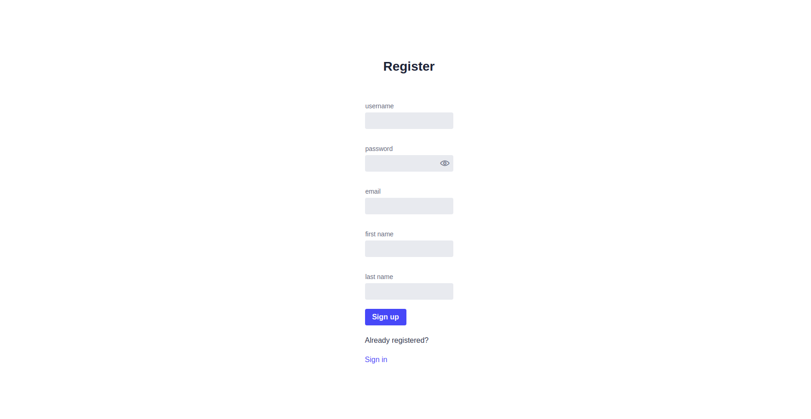
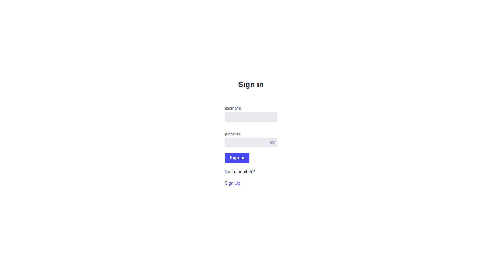
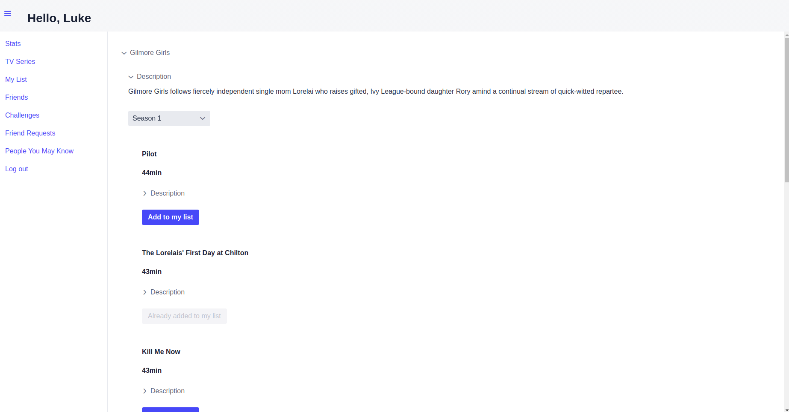
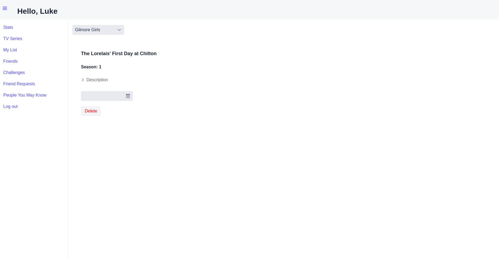
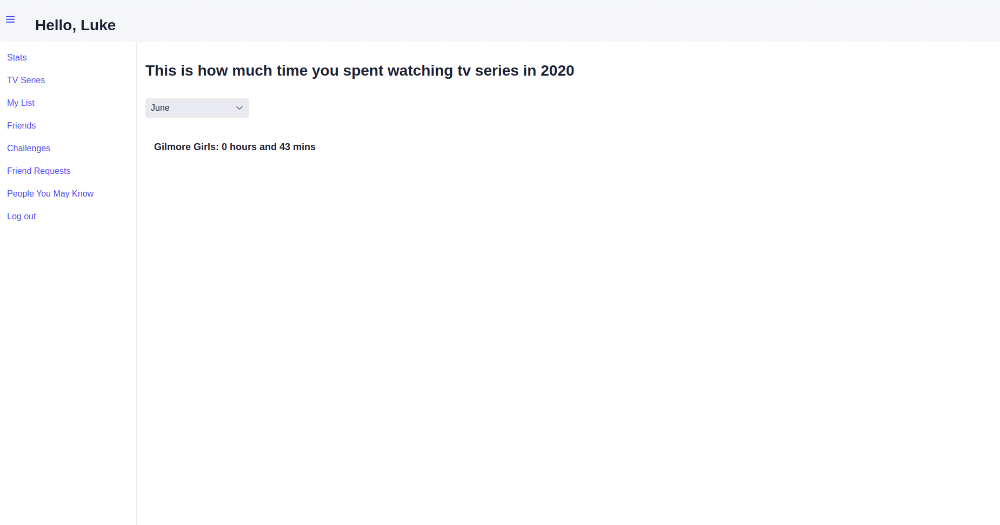
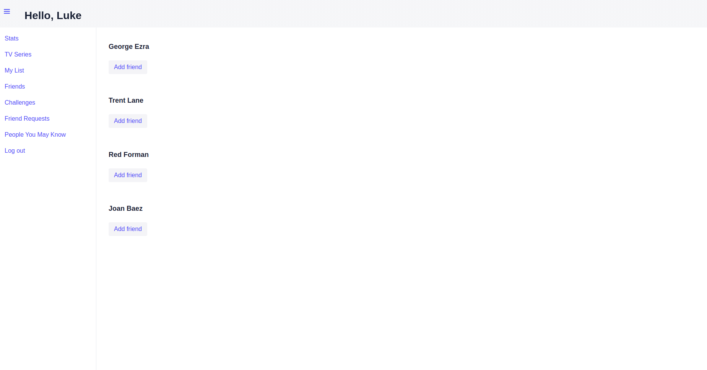
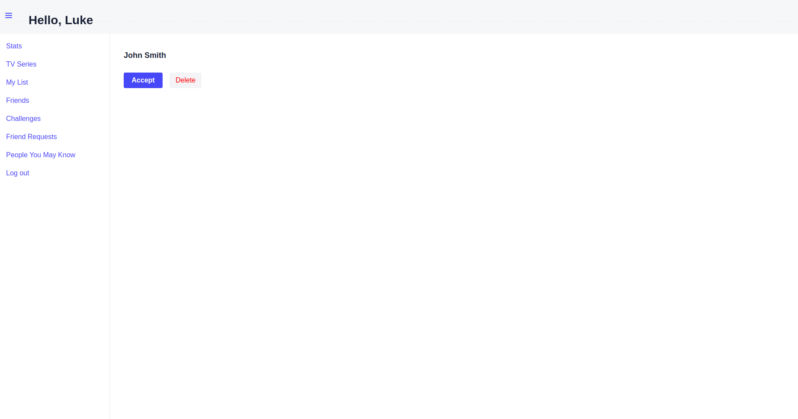
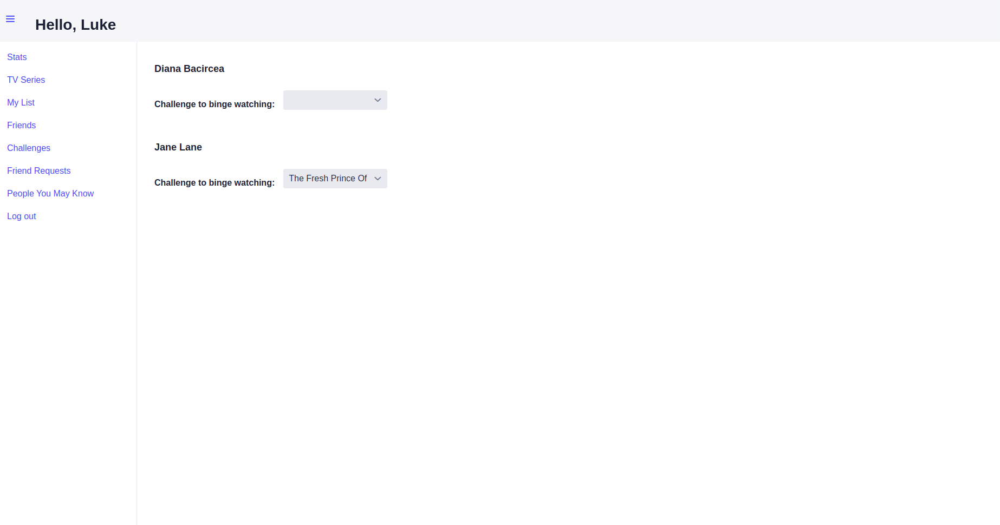
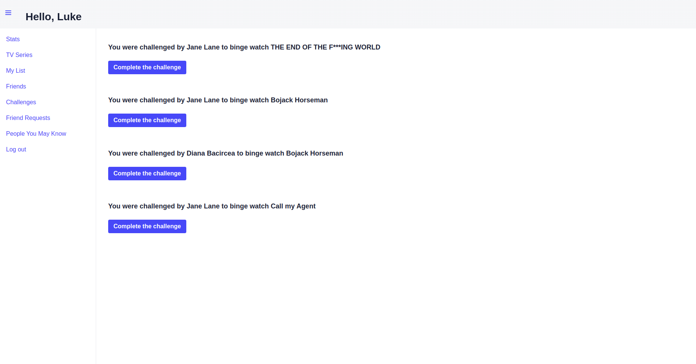

# tv-series-tracking-web-app

### A project created in Java using the Vaadin framework that keeps track of the TV series a person has watched. 
  * create and sign into an account
  
  
  * keep track of the episodes you watched by adding or removing them from your list
  
  
  * see how much time you spent watching your favourite series each month
  
  * befriend other users
  
  
  * challenge your friends to binge watch their favourite series and complete their challenges
  
  

