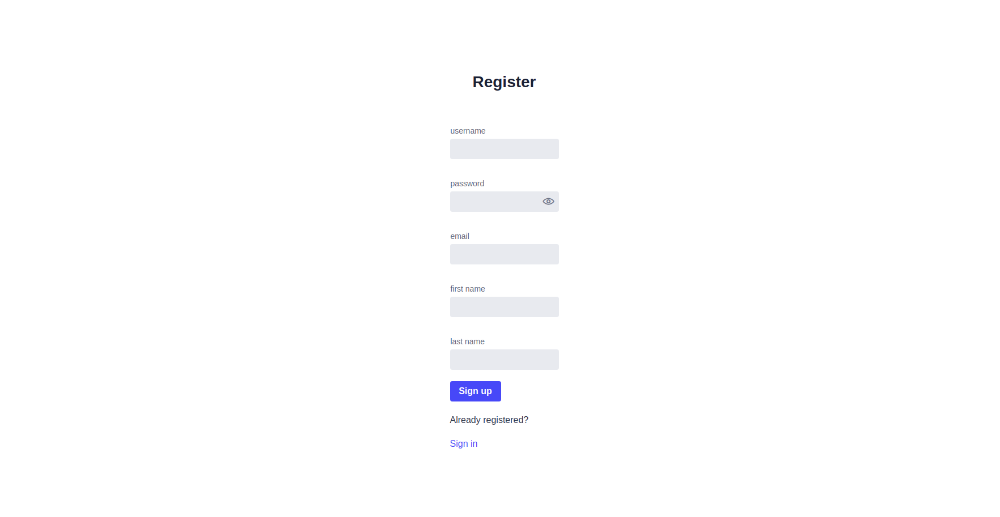
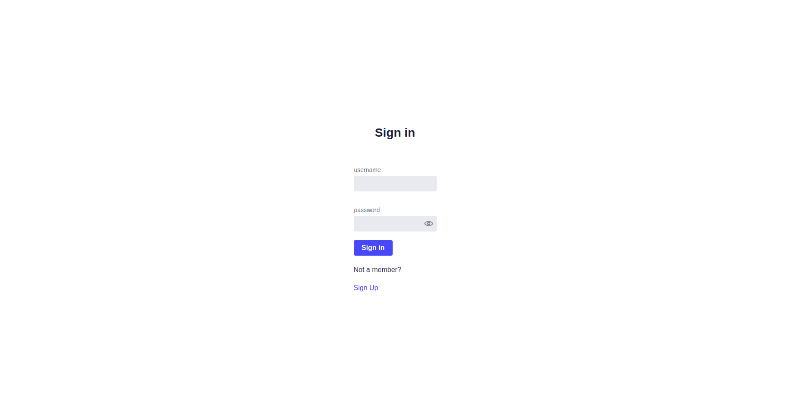
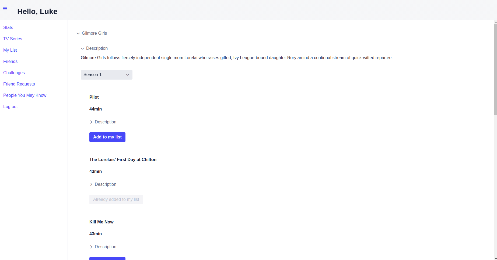
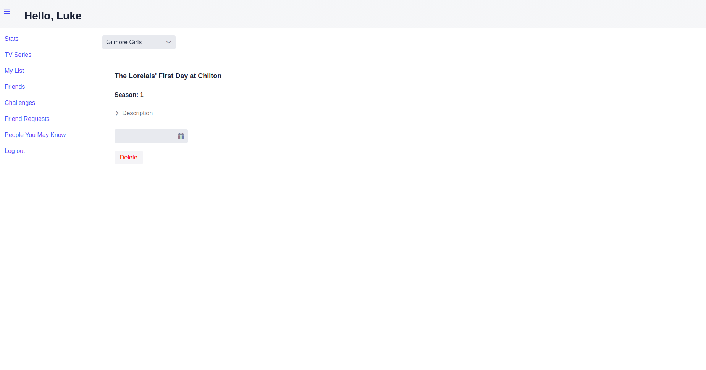
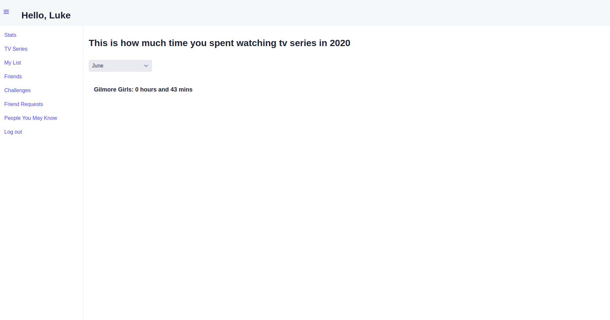
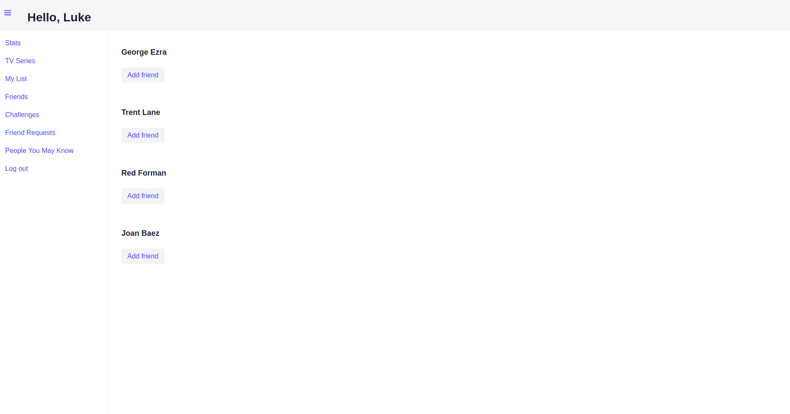
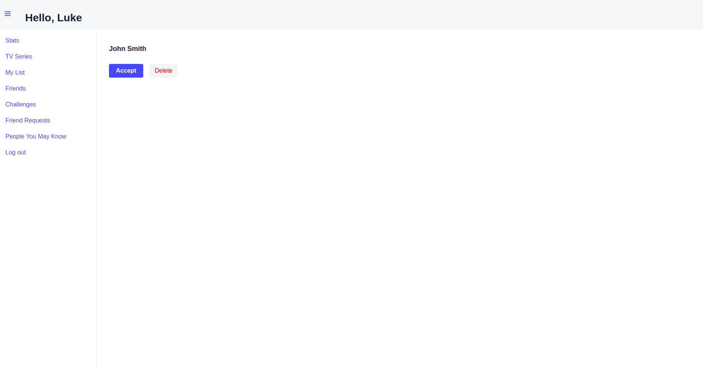
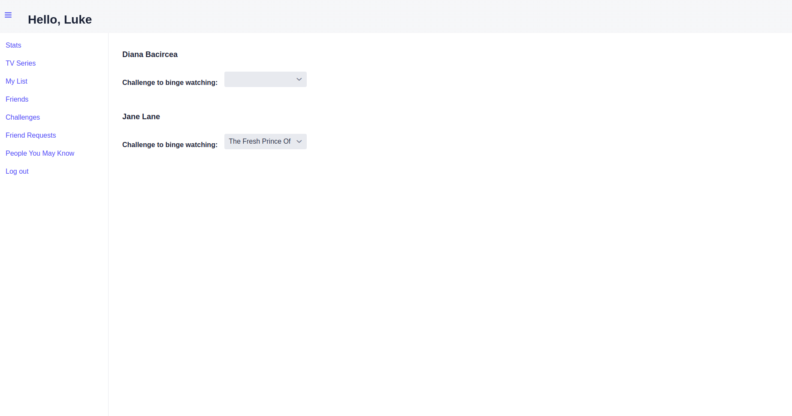
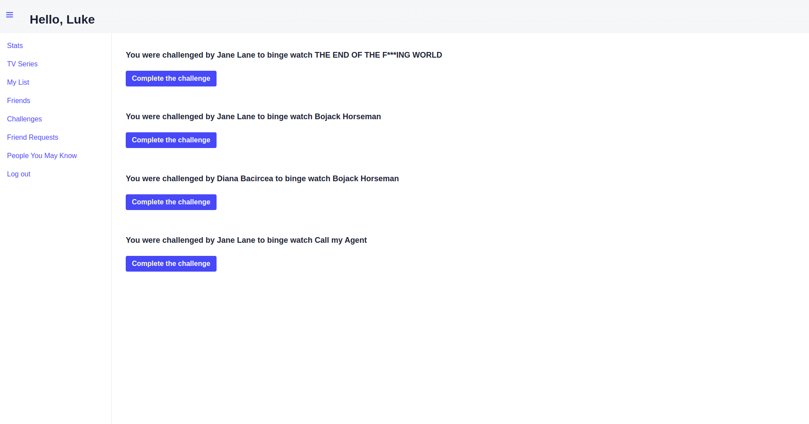
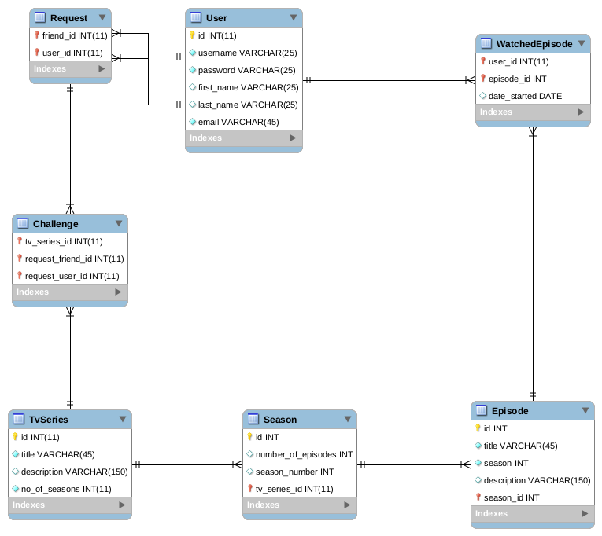

# TV series tracker

> **Original version:** this README and some fixes were added in 2026. To see the project exactly as it was first built, browse commit [`ec8cd38`](https://github.com/dianapaula19/tv-series-tracking-web-app/tree/ec8cd385ca10a27969818a371c1b33360cb6c69b) (2021-02-18).

A social web app for tracking the TV series you watch, built in Java with Spring Boot and Vaadin (2020).

  * create and sign into an account
  
  
  
  
  
  * keep track of the episodes you watched by adding or removing them from your list
  
  
  
  
  
  * see how much time you spent watching your favourite series each month
  
  
  
  * befriend other users
  
  
  
  
  
  * challenge your friends to binge watch their favourite series and complete their challenges
  
  
  
  

## Stack

Java 11, Spring Boot 2.2, Spring Data JPA, Vaadin 14, MySQL.



## Running

Needs a MySQL server with a database called `tv_series_tracking_db` (settings in
`src/main/resources/application.properties`; the host can be set with `MYSQL_HOST`).

```bash
./mvnw spring-boot:run      # then open http://localhost:8080
```
